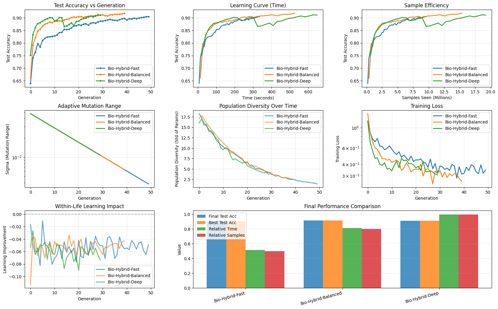

# 🧬 Bio-Inspired Hybrid Optimizer
This optimization approach combines Evolution Strategies (ES) with Stochastic Gradient Descent (SGD), inspired by stress-induced epigenetic memory. Enhanced by remixing [CMA-ES](https://github.com/CMA-ES/pycma) and [OpenAI-ES](https://github.com/openai/evolution-strategies-starter).

## 🎯 Our Journey

We explored various hybrid optimization strategies (as showing in the [Jupyter Notebook](es-sgd-benchmarking.ipynb)), learning from failures and gradually improving our approach:

| Approach | Test Accuracy | Key Insight |
|----------|--------------|-------------|
| **Initial Hybrid (v1)** | 0.7405 | ES and SGD conflicted, causing instability |
| **Adaptive Sigma** | 0.8300 | Dynamic noise helped, but still unstable |
| **Limited Perturbations** | 0.9132 | Reduced parameters improved stability |
| **Multi-scale mutations (Final)** | 0.9181 | Multi-scale mutations + within-life learning = stable convergence |

> 
> ```
> ======================================================================
> Final Results Summary
> ======================================================================
> Bio-Hybrid-Fast (pop_size=10, sgd_steps=150, generations=50):
>   Final Test Accuracy: 0.9042
>   Best Test Accuracy: 0.9042
>   Total Training Time: 334.7s
>   Total Samples: 9.60M
>   Final Sigma Value: 0.003847
>   Sample Efficiency: 0.0942 acc/M
> 
> Bio-Hybrid-Balanced (pop_size=15, sgd_steps=200, generations=40):
>   Final Test Accuracy: 0.9181
>   Best Test Accuracy: 0.9181
>   Total Training Time: 525.9s
>   Total Samples: 15.36M
>   Final Sigma Value: 0.006426
>   Sample Efficiency: 0.0598 acc/M
> 
> Bio-Hybrid-Deep (pop_size=20, sgd_steps=250, generations=30):
>   Final Test Accuracy: 0.9106
>   Best Test Accuracy: 0.9113
>   Total Training Time: 647.4s
>   Total Samples: 19.20M
>   Final Sigma Value: 0.010732
>   Sample Efficiency: 0.0474 acc/M
> ```

### 📊 What We Learned

1. **Catastrophic Forgetting is Real**: Grouping individual optimizers in parallel destroys learned knowledge
2. **Multi-Scale Matters**: Nature uses both small tweaks and large jumps - it works
3. **Separate Exploration from Exploitation**: ES for global search, SGD for local refinement

---

## 🚀 Quick Start

### Installation

```bash
# Clone the repository
git clone https://github.com/NewJerseyStyle/Bio-Inspired-Hybrid-Optimizer.git
cd Bio-Inspired-Hybrid-Optimizer

# Install dependencies
pip install numpy tensorflow matplotlib
```

### Basic Usage

```python
from HybridOptimizer import BioInspiredHybridOptimizer, MLP
from tensorflow.keras.datasets import mnist

# Load data
(x_train, y_train), (x_test, y_test) = mnist.load_data()
x_train = x_train.reshape(-1, 784).astype('float32') / 255.0
x_test = x_test.reshape(-1, 784).astype('float32') / 255.0

# Create model
model = MLP([784, 128, 64, 10])

# Create optimizer
optimizer = BioInspiredHybridOptimizer(
    model=model,
    population_size=15,      # Number of offspring per generation
    sgd_steps_per_life=200,  # How long each individual "lives"
    initial_sigma=0.05       # Initial mutation range
)

# Train
history = optimizer.train(
    x_train, y_train,
    x_test, y_test,
    generations=40
)

# Plot results
import matplotlib.pyplot as plt
plt.plot(history['test_acc'])
plt.xlabel('Generation')
plt.ylabel('Test Accuracy')
plt.title('Bio-Inspired Hybrid Training')
plt.show()
```

---

## 🧪 How It Works

### The Biological Analogy

Our optimizer mimics natural evolution:

```
┌──────────────────────────────────────────────────────┐
│  Generation N                                        │
│  ┌──────────┐                                        │
│  │  Parent  │ (Best from previous generation)        │
│  │  Genes   │                                        │
│  └────┬─────┘                                        │
│       │                                              │
│       ├──► Small Mutation ──► Individual 1           │
│       │    (σ × 0.3)          │                      │
│       │                       ├─► Lives & Learns     │
│       │                       │   (SGD for 200 steps)│
│       │                       └─► Final Fitness      │
│       │                                              │
│       ├──► Medium Mutation ──► Individual 2          │
│       │    (σ × 1.0)          └─► ...                │
│       │                                              │
│       └──► Large Mutation ──► Individual 3           │
│            (σ × 3.0)          └─► ...                │
│                                                      │
│  Select best individual → becomes parent for Gen N+1 │
└──────────────────────────────────────────────────────┘
```

### Three Key Explorations

1. **Multi-Scale Mutations**: Each generation includes small, medium, and large mutations
   - Small (30% sigma): Fine-tune near parent
   - Medium (100% sigma): Normal exploration
   - Large (300% sigma): Escape local optima

2. **Within-Life Learning**: Each offspring undergoes SGD training
   - Inherits "genes" (parameters) from parent
   - "Lives" for N SGD steps with learning rate decay
   - Only the best-adapted individual passes genes forward
     - 💡 What if we let top-k individual passes genes forward?

3. **Adaptive Sigma**: Mutation range automatically adjusts
   - Good progress → reduce sigma (exploit)
   - Stagnation → increase sigma (explore)

---

## 🎛️ Configuration Guide

### Population Size
```python
population_size=15  # Default: balanced
# Smaller (5-10): Faster but less exploration
# Larger (20-30): More exploration but slower
```

**Trade-off**: More individuals = better exploration but longer training time

### Total SGD Steps For Life
**Trade-off**: More steps = better local optimization but slower generations

### Initial Sigma
```python
initial_sigma=0.05  # Default: conservative
# Smaller (0.01-0.03): Careful exploration
# Larger (0.1-0.2): Aggressive exploration
```

**Trade-off**: Start large for rough landscapes, small for fine-tuning

---

## 📈 Monitoring Training

The optimizer tracks multiple metrics:

```python
history = optimizer.train(...)

# Available metrics:
history['test_acc']              # Test accuracy per generation
history['train_acc']             # Training accuracy
history['best_individual_acc']   # Best before SGD learning
history['sigma']                 # Mutation range evolution
history['population_diversity']  # Genetic diversity
history['time']                  # Cumulative time
history['samples_seen']          # Total samples processed
```

### Visualization Example

```python
import matplotlib.pyplot as plt

fig, axes = plt.subplots(2, 2, figsize=(12, 10))

# Accuracy
axes[0, 0].plot(history['test_acc'], label='Test')
axes[0, 0].plot(history['train_acc'], label='Train', alpha=0.7)
axes[0, 0].set_title('Accuracy Over Generations')
axes[0, 0].legend()

# Sigma adaptation
axes[0, 1].plot(history['sigma'])
axes[0, 1].set_title('Mutation Range (Sigma)')
axes[0, 1].set_yscale('log')

# Learning impact
learning_gain = [history['test_acc'][i] - history['best_individual_acc'][i] 
                 for i in range(len(history['test_acc']))]
axes[1, 0].plot(learning_gain)
axes[1, 0].set_title('Within-Life Learning Gain')
axes[1, 0].axhline(0, color='red', linestyle='--', alpha=0.3)

# Population diversity
axes[1, 1].plot(history['population_diversity'])
axes[1, 1].set_title('Population Diversity')

plt.tight_layout()
plt.show()
```

---

## 🔬 Advanced Usage

### Custom Fitness Functions

```python
class CustomOptimizer(BioInspiredHybridOptimizer):
    def live_and_learn(self, individual_params, x_train, y_train, gen_progress):
        # Your custom learning logic here
        # Example: add regularization, curriculum learning, etc.
        individual = self.base_model.copy()
        individual.set_params(individual_params)
        
        # Custom training loop
        for step in range(self.sgd_steps):
            # Your logic here
            pass
        
        return best_params, best_fitness
```

### Multi-Objective Optimization

```python
def multi_objective_fitness(model, x, y):
    accuracy = model.evaluate(x, y)
    complexity = np.linalg.norm(model.get_params())  # Penalize complexity
    return accuracy - 0.0001 * complexity
```

### Warm Starting

```python
# Start from a pre-trained model
pretrained_model = MLP([784, 128, 64, 10])
pretrained_model.set_params(pretrained_params)

optimizer = BioInspiredHybridOptimizer(model=pretrained_model, ...)
```

---

## 🤔 When to Use This Optimizer

### ✅ Good For:
- Combining global search with local refinement
- Experimenting possible optimization methods

### ❌ Not Ideal For:
- Extremely high-dimensional problems (>10M parameters)
- When pure SGD already works well and fast
- Real-time/online learning scenarios

---

## 📚 Research Background

This optimizer is inspired by:

1. **Stress-induced epigenetic memory/Lamarckian Evolution**: Organisms pass on learned characteristics (SGD learning)
2. **Natural Evolution Strategies (NES)**: Gradient-free optimization using evolution
3. **OpenAI-ES**: Scalable evolution strategies for deep learning
4. **CMA-ES**: Covariance Matrix Adaptation for adaptive step sizes

### Key Papers
- Salimans et al. (2017) - "Evolution Strategies as a Scalable Alternative to Reinforcement Learning"
- Hansen & Ostermeier (2001) - "Completely Derandomized Self-Adaptation in Evolution Strategies"
- Wierstra et al. (2014) - "Natural Evolution Strategies"

---

## 🛠️ Troubleshooting

### Problem: Accuracy drops after initial improvement
**Solution**: Reduce `initial_sigma` or increase `sgd_steps_per_life`

### Problem: Training is too slow
**Solution**: Reduce `population_size` or `sgd_steps_per_life`

### Problem: Gets stuck in local optimum
**Solution**: Increase `initial_sigma` or add more large-mutation individuals

### Problem: Unstable/oscillating accuracy
**Solution**: The optimizer may be exploring too aggressively - reduce sigma range

---

## 📝 Citation

If you use this optimizer in your research, please cite:

```bibtex
@software{bio_inspired_hybrid_optimizer,
  title={Bio-Inspired Hybrid Optimizer},
  author={Yuan Xu},
  year={2026},
  url={https://github.com/NewJerseyStyle/Bio-Inspired-Hybrid-Optimizer}
}
```

---

## 📜 License

MIT License - feel free to use in your projects!

**Happy Evolving! 🧬**
